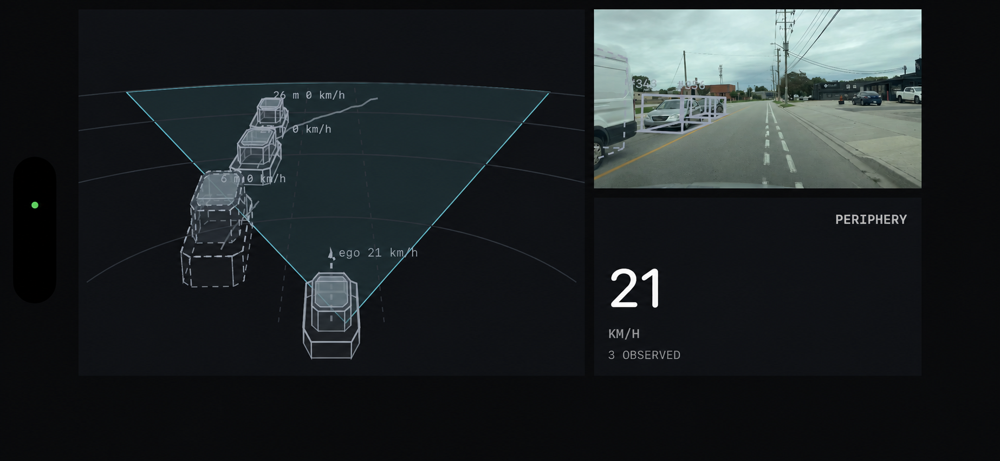

# Periphery iOS

Real-time monocular BEV vehicle detection on a windshield-mounted iPhone.

Periphery runs the Safety40 detector on-device, converts camera frames into
vehicle-frame detections, tracks vehicles over time, and renders the result as
a 2.5D bird's-eye view beside the camera feed.



## Key results

The current system has demonstrated:

| result | measurement |
|---|---:|
| Held-out vehicle precision | 72.3% |
| Held-out vehicle recall | 69.8% |
| Held-out vehicle F1 | 71.0% |
| Median centre error | 0.64 m |
| Median yaw error | 3.2° |
| iPhone 16 inference latency | 3.9 ms median, 7.9 ms p95 |

The held-out metrics use a 555-frame evaluation over 0–40 m at the 0.60
display threshold. The latency measurement is the detector pipeline after
warm-up; it does not include camera preprocessing.

## The idea

The phone sees the road through one camera. The model turns that image into a
metric scene description: where nearby vehicles are, how large they are, and
which direction they face. Swift then applies the geometry and tracking needed
to turn those detections into a stable visual view.

```text
camera frame + phone sensors
              │
              ▼
       calibration and crop
              │
              ▼
       Safety40 perception
              │
    ┌─────────┼─────────┐
    ▼         ▼         ▼
  boxes     ranges    headings
    └─────────┼─────────┘
              ▼
          tracking
              │
              ▼
       2.5D BEV display
```

The output is represented in the vehicle coordinate system, which makes it
useful for measuring distance, comparing motion, and rendering a consistent
virtual viewpoint.

## How the model is deployed

The detector is split into two Core ML models with a Swift geometry step between
them:

```text
image [1, 3, 256, 512]
        │
        ▼
backbone_static.mlpackage
        │
features [1, 64, 64, 128]
        │
        ▼
calibration-dependent voxel gather
        │
volume [1, 64, 41, 80, 2]
        │
        ▼
head_static.mlpackage
        │
class / box / direction outputs
        │
        ▼
Swift decode, threshold, and circular NMS
        │
        ▼
vehicle-frame detections
```

The gather is an index operation driven by the camera calibration, so it stays
outside the Core ML graph. Keeping decode in Swift also makes the final
post-processing path explicit and testable instead of relying on runtime-
specific graph behaviour.

## How the iOS code fits together

```text
CameraSession + MotionSource
            │
            ▼
        FramePipeline
            │
            ▼
      PerceptionEngine
            │
   ┌────────┼────────┐
   ▼        ▼        ▼
Preprocess Detector  Decode
             │        │
             └────┬───┘
                  ▼
           VehicleTracker
                  │
                  ▼
       PerceptionVisualization
            ┌─────┴─────┐
            ▼           ▼
        WorldView   camera overlay
```

`CameraSession` owns camera frame delivery and per-frame intrinsics.
`MotionSource` owns CoreMotion, CoreLocation, heading, and the barometer.
`FramePipeline` combines those inputs into a source-neutral frame.

`PerceptionEngine` is a backend that can work with live or recorded video. It
runs preprocessing, the detector, decode, and tracking.

`VehicleTracker` associates detections over time and maintains position,
dimensions, heading, motion state, velocity, and trails.

## Geometry and calibration

`Calibration.swift` owns the transform from vehicle coordinates to the sensor
and image frames. It handles the mount pose, per-frame camera intrinsics,
focal-matched cropping, network projection, source-frame projection, and ground
guides.

The model was trained at approximately 565.6 px focal length on a 512 px-wide
input. The source image is cropped and letterboxed to preserve that apparent
scale.

Camera height primarily scales the recovered range. Camera lateral offset
translates the coordinate origin. The replay demo applies those adjustments to
already-produced results so they can be tuned without rerunning inference.

## Tracking and display boundaries

The tracker uses range-dependent localization error when associating detections:

```text
radial sigma  = 0.18 + 0.0123 × range
lateral sigma = 0.08 + 0.005  × range
```

## Repository boundaries

This repository contains the iOS deployment project, Core ML model packages,
Swift implementation, resources, and deployment tooling.

| Area | iOS source |
|------|------------|
| Tensor and grid contract | `Periphery/Periphery/Periphery/Contract.swift` |
| Camera geometry | `Calibration.swift` |
| Image preparation | `Preprocess.swift` |
| Core ML execution | `Detector.swift` |
| Decode and NMS | `Decode.swift` |
| Association and motion state | `VehicleTracker.swift` |
| Camera and sensors | `CameraSession.swift`, `MotionSource.swift` |
| Live pipeline | `FramePipeline.swift`, `PerceptionEngine.swift` |
| Rendering | `PerceptionVisualization.swift`, `WorldView.swift` |
| Drive recording | `DriveRecorder.swift` |
| Replay | `ReplayProcessor.swift`, `ReplayView.swift` |
| Calibration diagnostics | `CalibrationView.swift`, `FlowView.swift` |
| Port verification | `SelfCheck.swift` |
