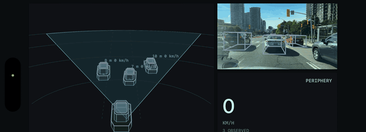

# Periphery iOS

Real-time monocular BEV vehicle detection on a windshield-mounted iPhone.

Periphery runs the Safety40 detector on-device, converts camera frames into
vehicle-frame detections, tracks vehicles over time, and renders the result as
a 2.5D bird's-eye view beside the camera feed.



## Key results

The current system has demonstrated:

| result | measurement |
|---|---:|
| Held-out vehicle precision | 72.3% |
| Held-out vehicle recall | 69.8% |
| Held-out vehicle F1 | 71.0% |
| Median centre error | 0.64 m |
| Median yaw error | 3.2° |
| iPhone 16 inference latency | 3.9 ms median, 7.9 ms p95 |

The held-out Cityscapes metrics use a 555-frame evaluation over 0–40 m at the
0.60 display threshold. The latency measurement is the detector pipeline after
warm-up.

## The idea

The phone sees the road through one camera. The model turns that image into a
metric scene description: where nearby vehicles are, how large they are, and
which direction they face. Swift then applies the geometry and tracking needed
to turn those detections into a stable visual view.

```text
camera frame + phone sensors
              │
              ▼
       calibration and crop
              │
              ▼
       Safety40 perception
              │
    ┌─────────┼─────────┐
    ▼         ▼         ▼
  boxes     ranges    headings
    └─────────┼─────────┘
              ▼
          tracking
              │
              ▼
       2.5D BEV display
```

The output is represented in the vehicle coordinate system, which makes it
useful for measuring distance, comparing motion, and rendering a consistent
virtual viewpoint.

## How the model is deployed

The detector is split into two Core ML models with a Swift geometry step between
them:

```text
image [1, 3, 256, 512]
        │
        ▼
backbone_static.mlpackage
        │
features [1, 64, 64, 128]
        │
        ▼
calibration-dependent voxel gather
        │
volume [1, 64, 41, 80, 2]
        │
        ▼
head_static.mlpackage
        │
class / box / direction outputs
        │
        ▼
Swift decode, threshold, and circular NMS
        │
        ▼
vehicle-frame detections
```

The gather is an index operation driven by the camera calibration, so it stays
outside the Core ML graph.

## How the iOS code fits together

```text
CameraSession.captureOutput                       a camera frame arrives
MotionSource                                      pose and ego motion for that timestamp
│
└─ FramePipeline                                  packs both into a PerceptionFrame
   │
   └─ PerceptionEngine.process(frame:)            ── everything below is this one call
      │
      ├─ calibrate(for:)                          mount pose + intrinsics
      │  └─ Detector.updateCalibration()          only when the pose or optics moved;
      │     └─ ProjectionLUT(projection:)         rebuilds the 6,560-voxel table
      │
      ├─ calibration.focalMatchedCrop()           the crop that hits 565.6 px focal
      │
      ├─ Preprocessor.fill(from:crop:)            CVPixelBuffer -> MLMultiArray
      │                                           returns [1,3,256,512] float32
      │
      ├─ Detector.detect(image:)                  takes that array
      │  ├─ run(backbone)                         -> features [1,64,64,128]
      │  ├─ gather()                              -> volume   [1,64,41,80,2]
      │  │  └─ ProjectionLUT.backproject()        the calibration-dependent index copy
      │  ├─ run(head)                             -> classes / boxes / directions
      │  └─ Decode.detections(...)                -> [Detection] in vehicle metres
      │
      └─ VehicleTracker.step(detections:ego:)     -> [TrackedObject] with stable ids
         │
         └─ returns PerceptionResult
            │
            └─ PerceptionVisualization            consumed by WorldView and the
                                                  camera overlay
```

## Geometry and calibration

| quantity | where it comes from |
|---|---|
| mount pitch and yaw | focus-of-expansion estimator, gyro-de-rotated |
| mount roll | gravity, from CoreMotion |
| camera height | measured once |
| camera intrinsics | per-frame from AVFoundation |
| lateral offset | measured once |
| trained focal, 565.6 px at 512 px wide | fixed by the checkpoint |

`Calibration.swift` composes them into the 3x4 matrix the projection LUT
consumes, dividing by the backbone stride so the table indexes the feature map
rather than the image.

| wrong about | range error grows | notes |
|---|---|---|
| **pitch** | **quadratic**, `dr/dtheta ~ r^2 / h` | the dominant term; 1.0 deg costs 16-23 F1 points |
| height | linear scale factor | recovered range scales directly with it |
| focal / crop | linear scale factor | a crop that misses 565.6 px rescales every range |
| yaw | linear in range, lateral | a yaw error `theta` puts a target at `r * theta` sideways |
| lateral offset | constant | translates the origin |

Only pitch grows with the square of range, which is why it became its own
subsystem rather than a one-time measurement.

## Repository boundaries

This repository contains the iOS deployment project, Core ML model packages,
Swift implementation, resources, and deployment tooling.

| Area | iOS source |
|------|------------|
| Tensor and grid contract | `Periphery/Periphery/Periphery/Contract.swift` |
| Camera geometry | `Calibration.swift` |
| Image preparation | `Preprocess.swift` |
| Core ML execution | `Detector.swift` |
| Decode and NMS | `Decode.swift` |
| Association and motion state | `VehicleTracker.swift` |
| Camera and sensors | `CameraSession.swift`, `MotionSource.swift` |
| Live pipeline | `FramePipeline.swift`, `PerceptionEngine.swift` |
| Rendering | `PerceptionVisualization.swift`, `WorldView.swift` |
| Drive recording | `DriveRecorder.swift` |
| Replay | `ReplayProcessor.swift`, `ReplayView.swift` |
| Calibration diagnostics | `CalibrationView.swift`, `FlowView.swift` |
| Port verification | `SelfCheck.swift` |
